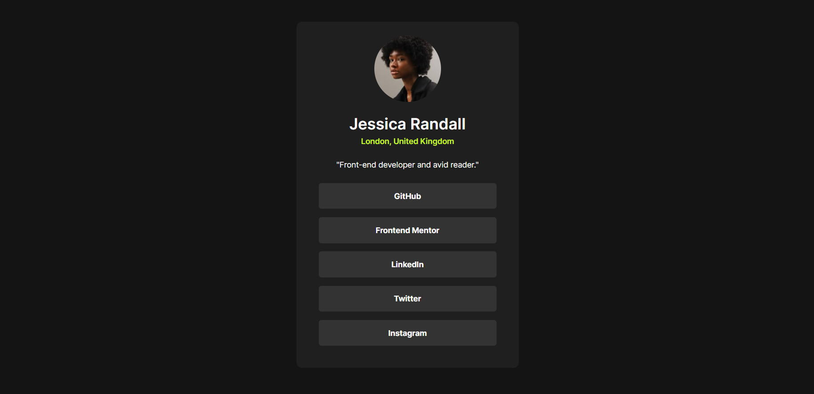
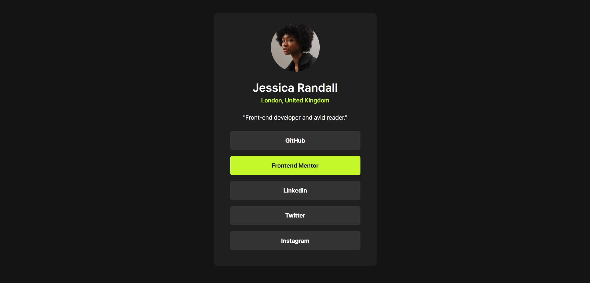

# Frontend Mentor - Social links profile solution

This is a solution to the [Social links profile challenge on Frontend Mentor](https://www.frontendmentor.io/challenges/social-links-profile-UG32l9m6dQ). Frontend Mentor challenges help you improve your coding skills by building realistic projects. 

## Table of contents

- [Overview](#overview)
  - [The challenge](#the-challenge)
  - [Screenshot](#screenshot)
  - [Links](#links)
- [My process](#my-process)
  - [Built with](#built-with)
  - [Continued development](#continued-development)
- [Author](#author)

## Overview

### The challenge

Users should be able to:

- See hover and focus states for all interactive elements on the page

### Screenshot

Page image and then page image with active button.

### Links

- [Solution URL](https://github.com/simplicioJoao/frontend-mentor-social-links-profile)
- [Live Site URL](https://simpliciojoao.github.io/frontend-mentor-social-links-profile/)

## My process

### Built with

- Semantic HTML5 markup
- CSS custom properties

### Continued development

The page is not responsive, therefore, I intend to learn about this subject, as well as improve my knowledge in styling web pages.

## Author

- Frontend Mentor - [@simplicioJoao](https://www.frontendmentor.io/profile/simplicioJoao)
- GitHub - [@simplicioJoao](https://github.com/simplicioJoao)
- LinkedIn - [João Paulo Simplicio](https://www.linkedin.com/in/joão-paulo-simplicio-612bb025a)
